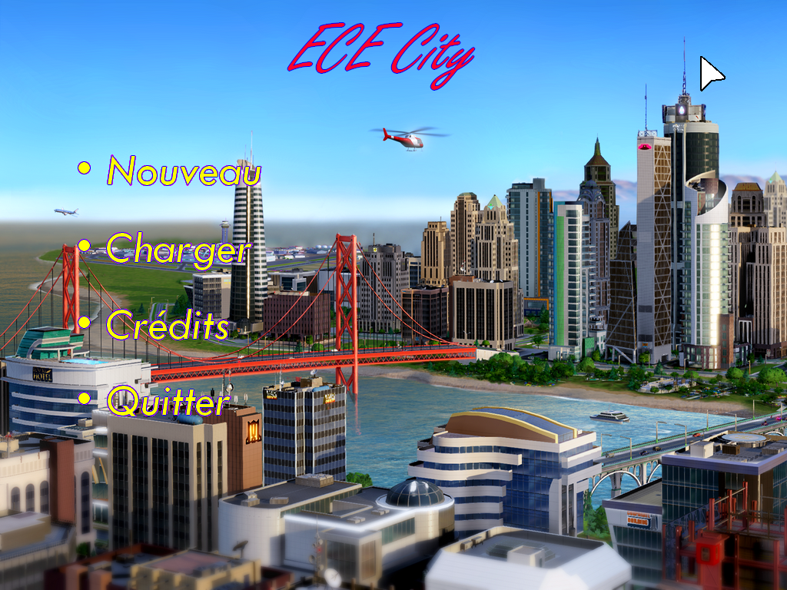
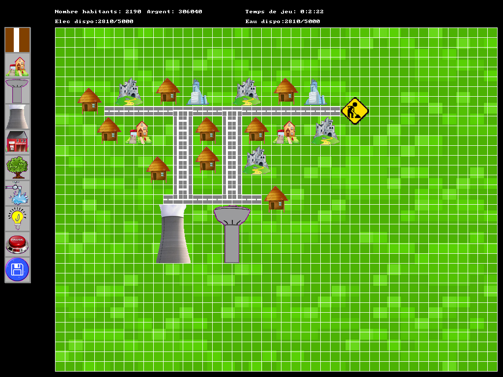
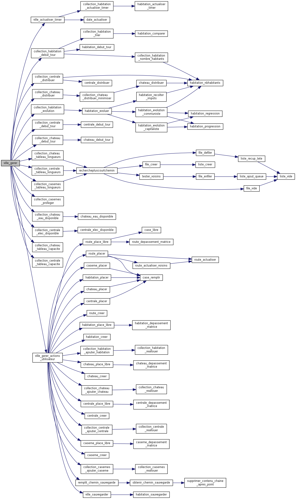

Second year project.
Graph Theory Video Game, developed in C with graphics library Allegro 4.2.

This video-game, inspired by the famous Sims City, allows the player to build a city and make it evolve.
The player can build houses, power plants, water towers, and connect them with roads/pipes.
The game is focused on resource management (power, water) in order to build the best city possible.
This management is based on <b>graph theory algorithms</b> such as finding the closest path with <b>BFS</b>.
The resources are shared between the different housing buildings by proximity to the resource facilities and with a goal to optimize the city (minimize the number of inhabitants lacking resources)
Housing buildings can also catch fire, in which case they can be saved by firefighters, if there is a station close enough.

Credits:  Gabriel M.R. , Quentin V.S., Elie S.

---------
Instructions to compile and run:
You need to install and link allegro 4.2